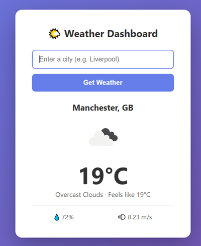

#  Weather Dashboard — Cloud Project 🌤️

A full-stack weather application deployed to **Microsoft Azure** with a complete **CI/CD pipeline**. Built from scratch to demonstrate end-to-end cloud engineering practices: containerization, Infrastructure as Code, automated deployment, and secret management.

> **Status:** ✅ Production-ready architecture · **Cloud:** Azure UK South · **Deployment:** Automated via GitHub Actions

---

## 📸 Web Interface

<p align="center">
  
</p>

---

## 🎯 Project Overview

This project takes a simple Python web app and runs it through the **complete modern deployment lifecycle**:

| Stage | What happens |
|-------|--------------|
| **Develop** | Flask app calls the OpenWeatherMap API and renders weather data |
| **Containerize** | App packaged into a Docker image with gunicorn |
| **Provision** | Azure infrastructure defined declaratively in Terraform |
| **Automate** | GitHub Actions builds, pushes, and deploys on every commit to `main` |
| **Run** | App live on Azure Container Instances with a public URL |


---

## 🏗️ Architecture

```
┌──────────────┐
│   You / VS   │
│     Code     │
└──────┬───────┘
       │ git push
       ▼
┌──────────────┐      ┌──────────────────┐
│   GitHub     │─────▶│ GitHub Actions   │
│  (source)    │      │     (CI/CD)      │
└──────────────┘      └──────┬───────────┘
                             │
                  ┌──────────┼──────────┐
                  ▼                     ▼
          ┌──────────────┐      ┌──────────────────┐
          │  Azure       │      │   Terraform      │
          │  Container   │      │  (IaC + remote   │
          │  Registry    │      │   state in Blob) │
          └──────┬───────┘      └──────┬───────────┘
                 │                     │
                 └──────────┬──────────┘
                            ▼
                  ┌─────────────────────┐
                  │  Azure Container    │
                  │     Instance        │
                  │  (public IP + DNS)  │
                  └─────────────────────┘
                            │
                            ▼
                  🌐 Live Weather Dashboard
```

---

## 🛠️ Tech Stack

**Application**
- Python 3.12 · Flask · Gunicorn · Jinja2 templates
- OpenWeatherMap REST API
- HTML5 / CSS3

**DevOps & Infrastructure**
- **Docker** — containerization with multi-stage caching
- **Terraform** — Infrastructure as Code
- **Azure CLI** — local cloud management
- **GitHub Actions** — CI/CD automation

**Azure Services**
- Azure Container Registry (ACR) — private Docker registry
- Azure Container Instances (ACI) — serverless container runtime
- Azure Blob Storage — remote Terraform state
- Azure Resource Manager — resource provisioning
- Azure Active Directory — Service Principal authentication

**Security**
- GitHub Secrets for credentials
- Service Principal with scoped Contributor role
- `.gitignore` and `.dockerignore` protecting `.env`, `.tfvars`, and state files
- API keys injected via `secure_environment_variables` (not baked into images)

---

## 📁 Project Structure

```
weather-dashboard/
├── .github/
│   └── workflows/
│       └── deploy.yml          # GitHub Actions CI/CD pipeline
├── terraform/
│   ├── main.tf                 # Azure resources (RG, ACR, ACI)
│   ├── providers.tf            # AzureRM provider + remote backend
│   ├── variables.tf            # Input variables
│   └── outputs.tf              # Output values (app URL, etc.)
├── templates/
│   └── index.html              # Jinja2 weather dashboard UI
├── docs/
│   └── dashboard.png           # App screenshot
├── app.py                      # Flask application
├── Dockerfile                  # Container image definition
├── requirements.txt            # Python dependencies
├── .dockerignore               # Excludes secrets and venv from image
├── .gitignore                  # Protects .env, .tfvars, state files
└── README.md
```

---

## 🚀 CI/CD Pipeline

The GitHub Actions workflow (`deploy.yml`) runs on every push to `main`:

1. **Checkout** code from the repo
2. **Authenticate** to Azure using a Service Principal
3. **Provision** the resource group and Container Registry via Terraform
4. **Build** the Docker image tagged with the Git commit SHA
5. **Push** the image to Azure Container Registry
6. **Deploy** by applying Terraform — recreates the Container Instance with the new image
7. **Output** the live app URL in the workflow logs


---

## 🔄 Local Development

```bash
# Clone and enter
git clone https://github.com/hamdani-al/weather-dashboard.git
cd weather-dashboard

# Create venv and install
python -m venv venv
venv\Scripts\activate          # Windows
pip install -r requirements.txt

# Add your API key
echo WEATHER_API_KEY=your_key_here > .env

# Run
python app.py
# → http://localhost:5000
```

## 🐳 Run via Docker

```bash
docker build -t weather-dashboard .
docker run -d -p 5000:5000 --env-file .env --name weather-app weather-dashboard
```

---

## 🎓 Skills Demonstrated

- Python web development with Flask
- Containerization (Dockerfile authoring, image optimization, registry workflows)
- Infrastructure as Code (Terraform syntax, providers, state, variables, outputs)
- Cloud platform fundamentals (Azure resource model, IAM, networking basics)
- CI/CD pipeline design (GitHub Actions, secret management, multi-step deploys)
- Secret and credential management across local, Docker, and CI contexts
- Cost-aware cloud engineering (resource lifecycle, destroy discipline)

---

**Built by [@in/ab997d/](https://www.linkedin.com/in/ab997d/)** 
